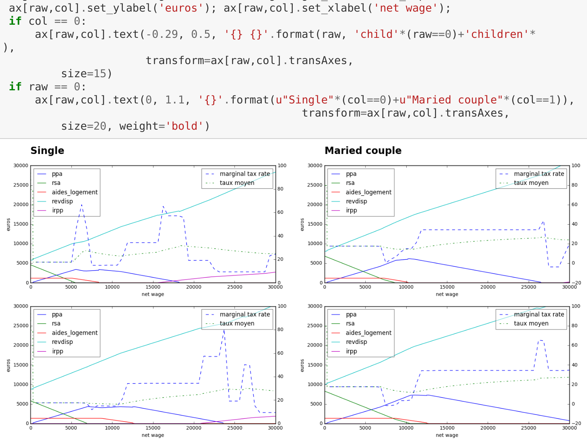
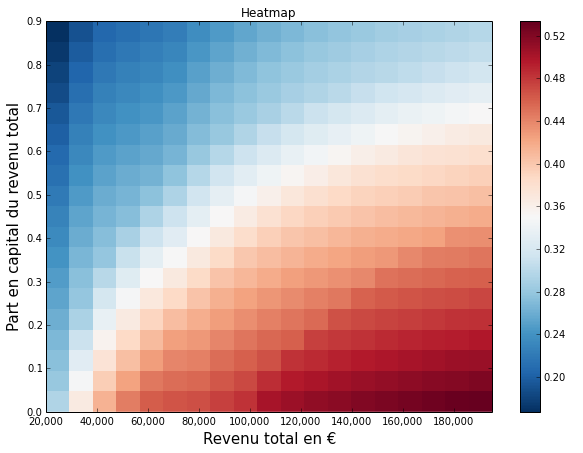
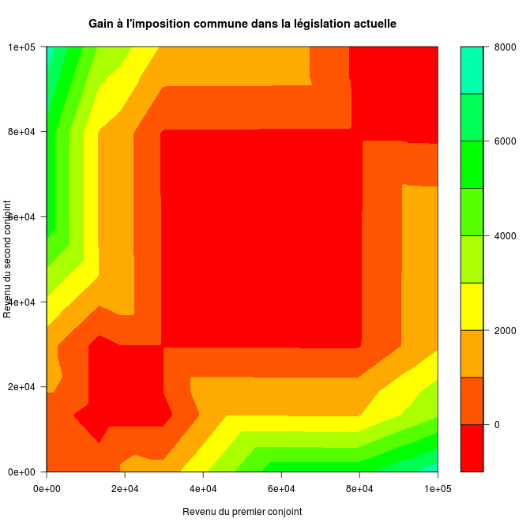

# Écrire la loi en Python

## openfisca.fr – @OpenFisca

---

# OpenFisca rend le droit calculable

- les impôts
- les aides
- l'entreprise
- autres

---

# Les polémiques

Exemple : [le RSA rapporterait plus que le SMIC](http://rue89.nouvelobs.com/rue89-eco/2013/03/12/la-fable-bidon-de-la-famille-rsa-qui-gagne-plus-que-la-famille-salariee-240493)


---

# Les problèmes en 2011

- les calculateurs sont éparpillés
- accessibles ou pas – mais propriétaires
- les démarches sont morcelées
- les économistes sont coincés

---

# Une solution


- modèle unifié en Python
- logiciel libre
- performance
- pédagogie

---

# Un calculateur

- une situation en entrée
- évaluation de formules de calcul
- un résultat en sortie
- simulateur – calculateur

---

# Un pari ambitieux

<div style="float: left; margin-right: 1em;">
  .center[]
</div>

---

# La réalité est complexe
# La loi est complexe
# Pas de simplification hâtive

---

# Exemple simplifié

```python
def impot(salaire):
    return salaire * 0.3
```

+++

# Exemple simplifié

```python
def impot(salaire):
    return salaire * 0.3


def allocations(salaire):
  return 1000 if salaire < 10000 else 0
```

+++

# Exemple simplifié

```python
def impot(salaire):
    return salaire * 0.3


def allocations(salaire):
  return 1000 if salaire < 10000 else 0


def revenu_disponible(salaire):
    return salaire
        - impot(salaire)
        + allocations(salaire)
```

---

# Exemple réel

```python
class revdisp(Variable):
    column = FloatCol(default = 0)
    entity_class = Menages
    label = u"Revenu disponible du ménage"

    def function(self, simulation, period):
        period = period.start.period('year').offset('first-of')
        rev_trav_holder = simulation.compute('rev_trav', period)
        pen_holder = simulation.compute('pen', period)
        rev_cap_holder = simulation.compute('rev_cap', period)
        psoc_holder = simulation.compute('psoc', period)
        ppe_holder = simulation.compute('ppe', period)
        impo = simulation.calculate('impo', period)

        pen = self.sum_by_entity(pen_holder)
        ppe = self.cast_from_entity_to_role(ppe_holder, role = VOUS)
        ppe = self.sum_by_entity(ppe)
        psoc = self.cast_from_entity_to_role(psoc_holder, role = CHEF)
        psoc = self.sum_by_entity(psoc)
        rev_cap = self.sum_by_entity(rev_cap_holder)
        rev_trav = self.sum_by_entity(rev_trav_holder)

        return period, rev_trav + pen + rev_cap + psoc + ppe + impo
```

---

# Visualisation

.center[]

+++

# Visualisation

.center[]

+++

# Visualisation

.center[]

---

# Utile pour les particuliers

- calculer des cas individuels
- connaître les aides
- estimer le coût d'embauche

---

# mes-aides.gouv.fr

.center[]

---

# embauche.beta.gouv.fr


---

# Utile pour les économistes

- calcul sur population entière
- études d'impact, réformes, gagnants, perdants

---

# Exemple : quotient conjugal




---

# Composants logiciels

- moteur de calcul : [OpenFisca-Core](https://github.com/openfisca/openfisca-core)
- législation Française : [OpenFisca-France](https://github.com/openfisca/openfisca-france)
- API Web HTTP+JSON
- api.openfisca.fr ou auto-hébergement

---

# Performances Python

- Python - NumPy
- calcul vectoriel
- 10 secondes pour 120 000 individus

---

# Fiabilisation

- par les tests (non-régression)
- par comparaison entre calculateurs
  - génération aléatoire de ~2000 familles
  - les écarts apparaissent

---

# Avril 2016 : ouverture du calculateur des impôts


---

# Les défis

- intégrer les calculateurs officiels
- fiabliser les calculs
- internationaliser
- attirer les contributeurs

---

# Appel à la contribution

- apportez votre savoir sur la loi
- utilisez OpenFisca pour un article
- implémentez des formules
- écrivez des applications
- proposez vos idées !

---

# OpenFisca rend le droit calculable

# Un outil neutre pour un débat informé

---

# Questions ?

## openfisca.fr – @OpenFisca – github.com/openfisca

---

# Source des slides

Sur [GitHub](https://github.com/openfisca/communication)
