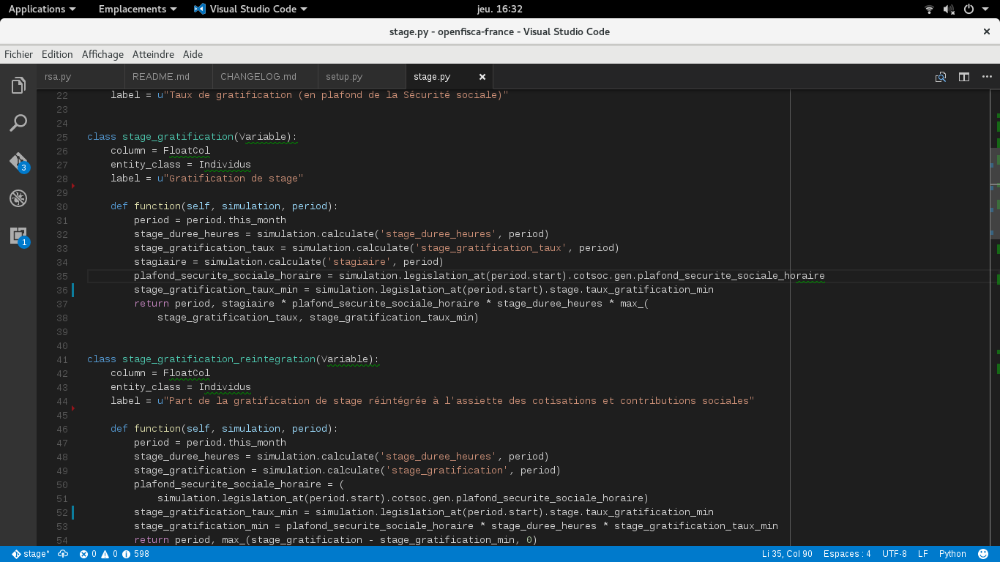

layout: true

<footer style="position: absolute; bottom: 0em; left: 0em; right: 0em;">
  
  
</footer>

---

class: center, middle

# Mise en commun des paramètres de la législation

Hackathon CodeGouv – 13 oct 2016

## openfisca.fr – @OpenFisca

---

# Situation actuelle

- multiples simulateurs DILA sous G6K
- OpenFisca
- données dupliquées

---

# Enjeux

- source de données unique
- co-maintenance des taux et plafonds
- séparation des responsabilités

---

# Paramètre dans G6K

```json
"TauxMinimal": [
    {
        "id": 1,
        "debutPeriode": "1900-01-01",
        "finPeriode": "2014-11-30",
        "taux": 12.5
    },
    {
        "id": 2,
        "debutPeriode": "2014-12-01",
        "finPeriode": "2014-12-31",
        "taux": 13.75
    }
]
```

---

# Transformé en XML OpenFisca

```xml
<CODE code="taux_gratification_min" origin="g6k">
  <VALUE deb="1900-01-01" fin="2014-11-30" valeur="12.5" />
  <VALUE deb="2014-12-01" fin="2014-12-31" valeur="13.75" />
  <VALUE deb="2015-01-01" fin="2015-08-31" valeur="13.75" />
  <VALUE deb="2015-09-01" fin="2016-12-31" valeur="15" />
</CODE>
```

---

<h1 style="margin: 0;">Utilisation dans OpenFisca</h1>



---

# Répartition des rôles

- G6K implémente le simulateur
- OpenFisca fournit les taux et les plafonds à G6K
- les mises à jour sont assurés dans OpenFisca par des experts métier