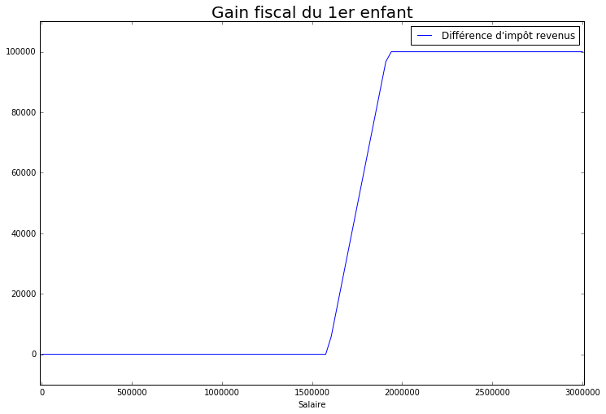

class: center

## OpenFisca Une approche permettant de répondre aux défis de la transparence et de l'évaluation.

Groupe 10 :
 
M Tandian – DGDI, M Kora Yaya – DGI Bénin
 
M Nsukami – Dev. Indé, M Diop Diagne – DGDI
 
M Benz – ETALAB, M Pacifico – AMSE

---

# Défis

- Évaluer l'impact des politiques fiscales
- Réduire la complexité des textes de loi
- Permettre un contrôle citoyen sur l'état de la fiscalité et les réformes engagées

---

# Solution OpenFisca

-	Outil de microsimulation libre
- Développement ouvert sur GitHub
- Adoptable par tous pays, institutions ou citoyens souhaitant développer, mettre à jour ou contrôler le système fiscal de son pays

---

## Proof of concept

Le gain fiscal pour un enfant au Sénégal :

---

# Conclusion

- Rend transparent, compréhensible et accessible à tous le système fiscal d'un pays
- Permet de faire de l'évaluation à priori et à postériori de réformes fiscales (très performant)
- Décloisonne les administrations
- Établit un standard international
