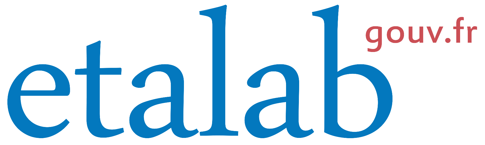
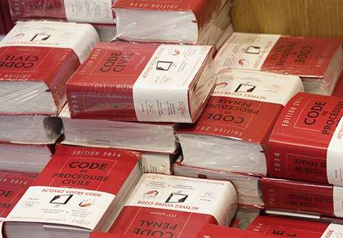
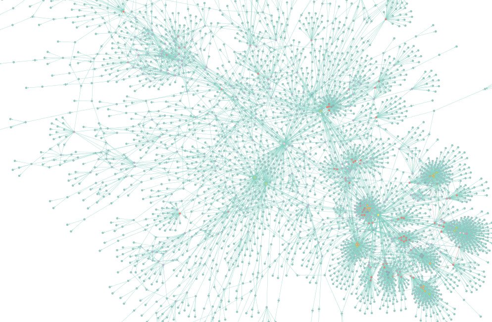
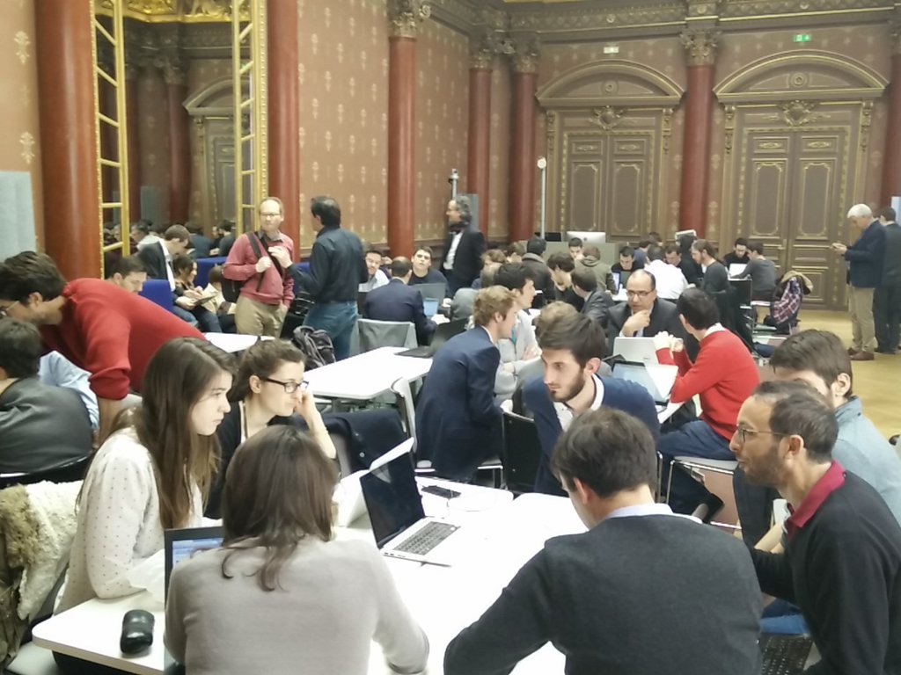
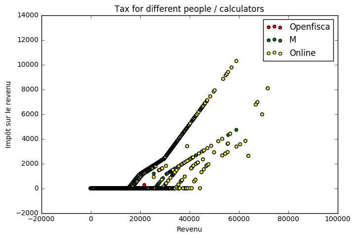

layout: true

background-image: url(background.png)
background-size: cover

<footer style="position: absolute; bottom: 1em; left: 1em; right: 5em;">
  
  
</footer>

---

class: center

# Libération du calculateur<br>des impôts

https://www.openfisca.fr/

https://framagit.org/openfisca

https://github.com/openfisca

@OpenFisca

Christophe Benz – christophe.benz@data.gouv.fr

???
lalala

---

# Complexité de la loi

.center[]

???
La loi ça vous parle ? Et si des geeks codeurs se mettaient à la transformer en code source en Python ?

---

# La loi en code source

```python
def impot_sur_le_revenu(salaire):
    return salaire * 0.3
```

---

# La loi en code source

```python
def impot_sur_le_revenu(salaire):
    return salaire * 0.3

def revenu_disponible(salaire):
    return salaire \
        - impot_sur_le_revenu(salaire) \
        + allocations(salaire)
```

## Et voilà !

---

# Visualisation

TODO Graphe de dépendance

???
En faisant un peu de parsing du code ou par d'autres techniques on peut visualiser les dépendances entre les formules.

---

# Visualisation des impôts

.center[]

???
Le graphe de la législation actuelle

---

# Historique d'OpenFisca

- accès impossible aux codes sources des administrations
- besoin de simuler des réformes
- petits scripts Python / NumPy

---

# Usages d'OpenFisca

- produits dédiés à un domaine
  - https://mes-aides.gouv.fr/
  - https://embauche.beta.gouv.fr/
- base de documentation
  - https://legislation.openfisca.fr/
- études d'impact, projets de lois, de réformes

???
l'IPP
Communauté du revenu de base

---

# Composants

- moteur de calcul : [OpenFisca-Core](https://github.com/openfisca/openfisca-core)
- législation Française : [OpenFisca-France](https://github.com/openfisca/openfisca-france)
- interfaces utilisateur web :
  - [démonstrateur](https://ui.openfisca.fr/)
  - [explorateur de la législation](https://legislation.openfisca.fr/)

---

# International

- il existe [OpenFisca-Tunisia](https://github.com/openfisca/openfisca-tunisia)
- début Novembre hackathon à Dakar (Sénégal)

---

# Technos

- Python
- NumPy
- Jupyter notebook
- API web : WSGI
- Refactorings : redbaron
- UI JavaScript (React)

---

# Python 3 ?

---

# Appréhender la complexité

- outils de trace
- explication des résultats des calculs

TODO développer
---

# Communauté

- métiers divers : économistes, développeurs, citoyens éclairés, start-uppers
-

---

# Contribution

- difficulté dans chaque domaine de la loi
- difficulté à appréhender le moteur et ses concepts

---

# Améliorations

- refactorings multiples (redbaron)
- abstraction dans les calculs (helpers)
- vers un arbre de calcul déclaratif ?


---

class: center, middle

# Calculateur des impôts
## surnomée la Calculette Impôts

---

# Un nouvel univers

- ce n'est pas OpenFisca
- périmètres différents
- implication des devs d'OpenFisca

???
Le code M couvre les impôts sur les revenus, OpenFisca couvre en plus le social, l'entreprise...

---

# Étapes de la libération

TODO Dates

- étudiant-chercheur en économie
- dépose d'une demande CADA => OK
- décision du tribunal administratif
- février 2016 : livraison du code source
- avril 2016 : [hackathon](https://forum.openfisca.fr/t/guide-pratique-du-hackathon-codeimpot/42) à la fondation Mozilla

---

# Le langage M

- pas un mauvais choix
- un langage dédié ou DSL
- adapté aux non informaticiens
- le poids de l'histoire

???
Le langage M propose des constructions pas aussi simples qu'elles pourraient l'être.

---

# Exécution... impossible

- il manque le compilateur :-/
- un chantier :
  - transpilation de M vers Python
  - moteur de calcul en Python en standalone
  - API web en Python

---

# M vers Python

TODO Illustrer

- grammaire « PEG » avec [Arpeggio](http://igordejanovic.net/Arpeggio/getting_started/)
- génération d'un arbre syntaxique en JSON
- interpréter l'AST ou le compiler en Python

---

# API Web


- API web de calcul

???
API Web différente de celle d'OpenFisca

---

# Command-Line Interface

```
$ calculette-impots info TSHALLOV
{
  "TSHALLOV": {
    "variable_definition": {
      "alias": "1AJ",
      "description": "Salaires - Declarant 1",
      "tgvh_linecol": [ [ 13637, 1 ], [ 13637, 200 ] ],
      "type": "variable_saisie"
    },
    "variable_reverse_dependencies": [
      "PERP_INDV",
      "PPENEXOV",
      "PPE_BOOL_ACT_COND",
      "PPE_BOOL_NADAV",
      [...]
    ]
  }
}
```

---

# Command-Line Interface

Un célibataire sans enfants gagnant 30000€ par an :
```
$ calculette-impots calculate V_ANREV=2014 \
  TSHALLOV=30000 IRN --no-verifs
{
  "calculate_results": {
    "IRN": 2461
  }
}
```

---

# Command-Line Interface

Un couple marié (date du mariage 05/05/1980) sans enfants dont le déclarant 1 gagne 10000€ par an
et le déclarant 2 gagne 20000€ par an :
```
$ calculette-impots calculate V_ANREV=2014 \
  TSHALLOV=10000 TSHALLOC=20000 V_0AM=1 V_0AX=05051980 IRN --no-verifs
{
  "calculate_results": {
    "IRN": 264
  }
}
```

---

# Hackathon #CodeImpot

.center[]

???
- différents ateliers (TODO la liste)

---

# Démocratie ++

- compréhension du système socio-fiscal
- possibilité de reproduire les études d'experts
- un outil neutre pour un débat informé

???
Phrases démagogiques... les pauvres qui tirent sur la corde

---

# Nouvelles opportunités

- simulateur offline en JavaScript
- opportunités de business
- tester des réformes politiques

---

# Apports au projet

- projet libre enrichi
- fiabilisation
  - tests
  - comparaison des résultats
- extraction de données : taux, barèmes

---

# Comparaison des résultats

- génération de population aléatoire (TODO comment)
- exécution des calculs dans les différents simulateurs
- comparaison [graphique](https://github.com/openfisca/combine-calculators/blob/master/scripts/visual_comparisons.ipynb) des résultats
- référence : le simulateur en ligne des impôts

---

# Impôt par calculateur

.center[]

---

## Différences avec le simulateur impots.gouv.fr

.center[]

---

# Débriefing sur M

- le code M libéré n'est pas appelé correctement
- transformation en Python à améliorer
- il faut itérer avec l'équipe M
- les tests
- le code source des années précédentes / suivantes

---

# Tendance à l'ouverture

- ouverture du [simulateur INES](https://git.framasoft.org/openfisca/ines-libre) par l'INSEE
- TODO

---

# Conclusions

- l'État tend à plus d'ouverture
  - OpenData à Etalab
  - Codes sources
- bénéficie à la société civile
- besoin de modélisation ouverte des lois
- technologies ouvertes et standard

TODO

---

# Source des slides

https://github.com/openfisca/communication/tree/master/docs/PyConFR-2016

---

# Questions
