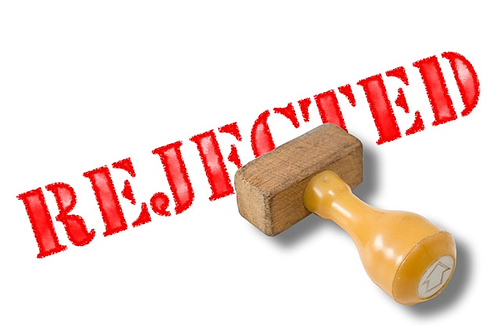
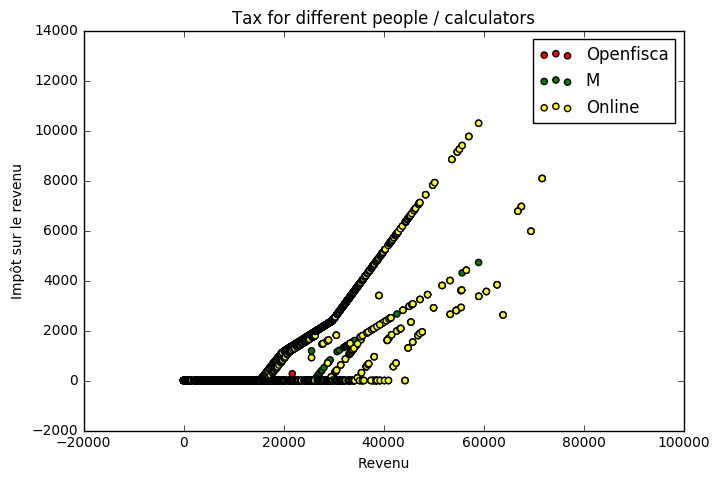
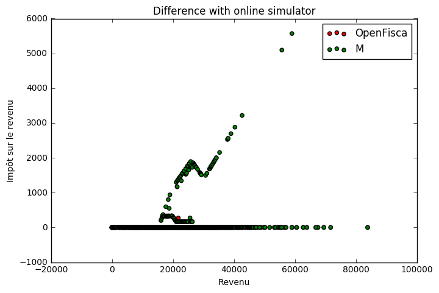
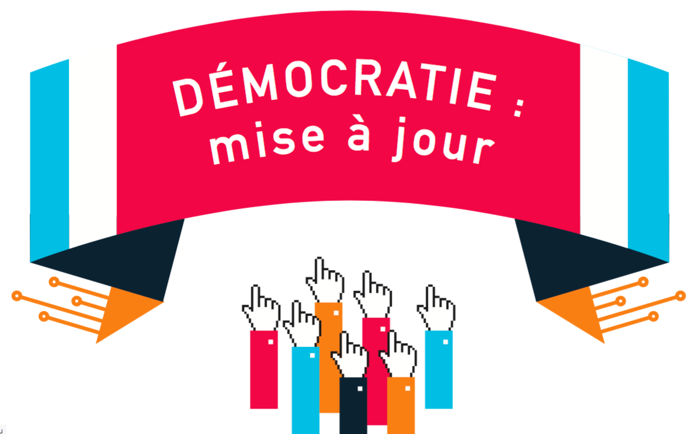

layout: true

<footer style="position: absolute; bottom: 0em; left: 0em; right: 0em;">
  
  
</footer>

---

class: center, middle

# Écrire la loi en Python

PyCon France 2016 à Rennes

[Christophe Benz](mailto:christophe.benz@data.gouv.fr)

# openfisca.fr

???

Je m'appelle ... je vais vous parler de comment on écrit la loi en Python depuis quelques années.

---

# Quelles lois

- les impôts
- les aides
- l'entreprise
- autres

???

Quelles lois sont calculées ? Tout ce qui se calcule en euros. On parle de lois fiscales pour les impôts et sociales pour les aides.

Anecdote Mahdi

---

# Calculateur


- une situation en entrée
- évaluation de formules de calcul
- un résultat en sortie
- simulateur – calculateur

???
Qu'est-ce qu'un calculateur ?

- on entre des individus, familles, salaires, loyer, etc.
- on calcule par exemple l'impôt sur le revenu, les allocations familiales, etc.
- le terme calculateur est employé lorsque le résultat est officiel, sinon on dit un simulateur

---

TODO Dessin des simulateurs fermés

certains ouvert mais pas libres (surtout web)

.center[]

???

Problèmes :

- la connaissance est éparpillée et inaccessible
- les citoyens perdent du temps
- les économistes sont coincés

---

# Une solution


- unique modèle ouvert
- calculateur
- logiciel libre
- indépendance

???

Pour y remédier on peut soit se battre pour l'ouverture, soit créer une alternative en dehors de l'état.

---

# Un pari ambitieux

<div style="float: left; margin-right: 1em;">
  .center[]
</div>

Qui maîtrise le sujet ?

<br><br>Traduction en code source ?

???
On part des textes de loi, complexes vous en conviendrez.
Économistes et développeurs font bon ménage, les geeks veulent écrire la loi en Python.
C'est un pari ambitieux mais on finit par y arriver !

---

# La loi en code source

```python
class iai(Variable):
    column = FloatCol
    entity_class = FoyersFiscaux
    label = "Impôt avant imputations de l'impôt sur le revenu"

    def function(self, simulation, period):
        period = period.this_year
        iaidrdi = simulation.calculate('iaidrdi', period)
        plus_values = simulation.calculate('plus_values', period)
        cont_rev_loc = simulation.calculate('cont_rev_loc', period)
        teicaa = simulation.calculate('teicaa', period)

        return period, iaidrdi + plus_values + cont_rev_loc + teicaa
```

???
Voici un exemple de formule dans OpenFisca.

---

# Visualisation des formules


???
On peut dessiner un graphe de dépendances des formules.

---

class: center, middle

# La loi est complexe
# La réalité est complexe
# Pas de simplification hâtive

???
La philosophie du projet OpenFisca est que si on simplifie trop tôt on risque de léser des tas de gens.
Il vaut mieux d'abord appréhender cette complexité avec les bons outils.

---

class: center, middle


Démonstrateur – https://ui.openfisca.fr/

???
Par exemple on a ici réunis au même endroit un ensemble d'indicateurs qui auparavant étaient éparpillés dans de nombreux calculateurs.

---

# Exemple simplifié

```python
def impot(salaire):
    return salaire * 0.3
```

???
Prenons un peu de recul pour mieux comprendre : codons l'impôt sur le revenu.

---

# Exemple simplifié

```python
def impot(salaire):
    return salaire * 0.3

def allocations(salaire):
  return 1000 if salaire < 10000 else 0
```

---

# Exemple simplifié

```python
def impot(salaire):
    return salaire * 0.3

def allocations(salaire):
  return 1000 if salaire < 10000 else 0

def revenu_disponible(salaire):
    return salaire - impot(salaire) + allocations(salaire)
```

## Et voilà !

---

# Fiabilisation par les tests

- tests écrits en même temps que les formules
- tests consolidés suite à la détection d'erreurs
- [outil web](https://mes-aides.gouv.fr/tests/) de création de tests

???
- Comment peut-on s'assurer que ces formules sont justes càd reflètent bien la loi ?
- Comme pour les logiciels avec les tests unitaires.
- Les tests sont écrits en même temps que les formules.
- Lorsqu'on s'aperçoit qu'il existe une erreur de calcul, on crée un test et on le fait passer.
- Il existe un outil web pour déclarer des tests

---

# Composants logiciels

- moteur de calcul : [OpenFisca-Core](https://github.com/openfisca/openfisca-core)
- législation Française : [OpenFisca-France](https://github.com/openfisca/openfisca-france)
- il existe aussi [OpenFisca-Tunisia](https://github.com/openfisca/openfisca-tunisia)
- API Web HTTP+JSON
- api.openfisca.fr ou auto-hébergement

???
début Novembre hackathon à Dakar (Sénégal)

---

# Calculer des cas individuels

- https://mes-aides.gouv.fr/
- https://embauche.beta.gouv.fr/
- à vous de jouer !

???
Ces produits appellent en bout de chaîne l'API web d'OpenFisca.

---

# Calculer sur une population

- données secrètes / données générées
- réformes : qui gagne, qui perd ?
- calcul vectoriel avec NumPy

???
Plus intéressant : on peut simuler une population

10 secondes pour 120 000 individus

TODO illustration suppression de la tranche d'impôts


---

# Base de documentation

.center[]

???
Avant même de faire des calculs, OpenFisca peut servir de base de documentation.

---

# Nouveaux problèmes

- fiablité
- non-officiel
- contributions

???
Une fois qu'on a ces outils libres de nouveaux problèmes se posent.

---

# La « Calculette Impôts »

- libérée en avril 2016
- OpenFisca en bénéficie
- implication des développeurs d'OpenFisca

???
L'administration fiscale a ouvert son calculateur en avril 2016 sous licence libre.

Le code M couvre les impôts sur les revenus, OpenFisca couvre en plus le social, l'entreprise...

---

exclude: true

# Étapes de la libération

TODO Dates

- étudiant-chercheur en économie
- dépose d'une demande CADA => OK
- décision du tribunal administratif
- février 2016 : livraison du code source
- avril 2016 : [hackathon](https://forum.openfisca.fr/t/guide-pratique-du-hackathon-codeimpot/42) à la fondation Mozilla

---

# Compilation en Python

- langage M, remonte à 1989
- livré sans le compilateur
- écriture d'un compilateur en Python

???
adapté aux non informaticiens

---

# M vers Python

TODO Illustrer

- grammaire « PEG » avec [Arpeggio](http://igordejanovic.net/Arpeggio/getting_started/)
- génération d'un arbre syntaxique en JSON
- interpréter l'AST ou le compiler en Python
- fournir des outils (CLI, API Web)

---

# Command-Line Interface

Un célibataire sans enfants gagnant 30000€ par an :
```
$ calculette-impots calculate V_ANREV=2014 \
  TSHALLOV=30000 IRN --no-verifs
{
  "calculate_results": {
    "IRN": 2461
  }
}
```

---

# Command-Line Interface

Un couple marié (date du mariage 05/05/1980) sans enfants dont le déclarant 1 gagne 10000€ par an
et le déclarant 2 gagne 20000€ par an :
```
$ calculette-impots calculate V_ANREV=2014 \
  TSHALLOV=10000 TSHALLOC=20000 V_0AM=1 V_0AX=05051980 IRN --no-verifs
{
  "calculate_results": {
    "IRN": 264
  }
}
```

---

# Hackathon #CodeImpot

.center[]

---

# Ateliers du hackathon

- M vers JavaScript : simulateur web offline !
- code législatif vers code source
- optimisation du temps de calcul
- correspondances M / OpenFisca
- gain à la déclaration commune
- réformes : revenu de base

---

exclude: true

# Démocratie ++

TODO Redites...

- transparence
- compréhension du système socio-fiscal
- possibilité de reproduire les études d'experts
- un outil neutre pour un débat informé
- simulateur offline en JavaScript
- opportunités de business
- tester des réformes politiques

???
L'API web peut être remplacée par un simulateur offline en JavaScript !
Phrases démagogiques... les pauvres qui tirent sur la corde

---

## Que peut apporter la libération de la Calculette Impôts à OpenFisca ?

- fiabilisation des résultats
- faire tourner les tests
- extraction de données : taux, barèmes

???
S'assurer que les calculs sont justes

---

# Comparaison des résultats

- génération de population aléatoire
- exécution des calculs dans les différents simulateurs
- référence : le simulateur en ligne des impôts
- comparaison [graphique](https://github.com/openfisca/combine-calculators/blob/master/scripts/visual_comparisons.ipynb) des résultats

???
TODO comment est générée la population ?

---

exclude: true

# Impôt par calculateur

.center[]

---

exclude: true

## Différences avec le simulateur impots.gouv.fr

.center[]

---

# Synthèse des différences

- 2000 cas aléatoires : déclaration simplifiée
- 2 erreurs pour OpenFisca \o/
- plus d'erreurs pour la Calculette Impôts
- mais travail à poursuivre
- il faut itérer avec l'équipe M

???

- le code M libéré n'est pas appelé correctement (vérifs)
- transformation en Python à améliorer
- cas générés simples, cases de la déclaration simplifiée
- si on ajoute des cases d'autres erreurs vont apparaître dans OpenFisca

---

# Tendance à l'ouverture

- ouverture du [simulateur INES](https://git.framasoft.org/openfisca/ines-libre) par l'INSEE
- TODO

---

# Comment aider ?

TODO

- envie de simuler un domaine particulier de la loi
- envie d'écrire un outil
- envie d'améliorer les choses

---

# Améliorations possibles

- refactorings multiples (redbaron)
- faciliter l'édition des formules
- abstraction dans les calculs (helpers)
- vers un arbre de calcul déclaratif ?

---

class: center, middle

## L'État tend à plus d'ouverture.
## La société civile en bénéficie.

.center[[](http://www.renaissancenumerique.org/publications/rn/792-2016-04-18-08-25-24)]

# Un outil neutre pour un débat informé

---

class: center, middle

# Source des slides

Sur [GitHub](https://github.com/openfisca/communication/tree/master/docs/PyConFR-2016)

---

class: center, middle

# Questions
