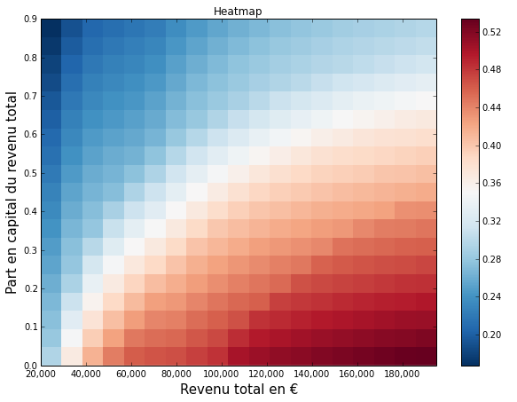

layout: true

<footer style="position: absolute; bottom: 0em; left: 0em; right: 0em;">
  
  
</footer>

---

class: center, middle

# Écrire la loi en Python

PyCon France 2016 à Rennes

## openfisca.fr – @OpenFisca

[Christophe Benz](mailto:christophe.benz@data.gouv.fr)

???

Je m'appelle ... je travaille à Etalab, service du premier ministre.

Je vais vous parler de :

- comment on écrit la loi en Python depuis quelques années
- quels sont les enjeux démocratiques
- ce qui se passe lorsque l'état libère son logiciel de calcul de l'impôt
- en quoi la situation s'est améliorée depuis 2011

Je suis développeur, au départ je n'y connaissais rien en fiscalité mais ce n'est pas un problème pour participer au projet !

---

# Quelles lois ?

- les impôts
- les aides
- l'entreprise
- autres

???

Quelles lois sont écrites en Python ? Tout ce qui se calcule en euros. On parle de lois fiscales pour les impôts et sociales pour les aides.

---

# Les polémiques

Exemple : [le RSA rapporterait plus que le SMIC](http://rue89.nouvelobs.com/rue89-eco/2013/03/12/la-fable-bidon-de-la-famille-rsa-qui-gagne-plus-que-la-famille-salariee-240493)


???

- politiques et journalises affirment des choses, créant des polémiques
- polémiques naissent d'une trop grande complexité
- Pourquoi écrire la loi en Python ?
  - pour effectuer des calculs fiables
  - fonder la décision sur des résultats reproductibles.

---

# Les problèmes en 2011

- les calculateurs sont éparpillés
- accessibles ou pas – mais propriétaires
- les démarches sont morcelées
- les économistes sont coincés

???

- la situation n'est pas idéale
- les domaines de la loi sont inter-dépendants

---

# Une solution


- modèle unifié en Python
- logiciel libre
- performance
- pédagogie

???

Pour y remédier on peut soit se battre pour l'ouverture, soit créer une alternative en dehors de l'état.

---

# Un calculateur

- une situation en entrée
- évaluation de formules de calcul
- un résultat en sortie
- simulateur – calculateur

???

Pour cela il nous faut un calculateur et des formules de calcul :

- on entre une situation : des individus, familles, salaires, loyer, etc.
- on calcule par exemple l'impôt sur le revenu, les allocations familiales, etc.
- le terme calculateur est employé lorsque le résultat est officiel, sinon on dit un simulateur

---

<h1 style="margin: 0">Un pari ambitieux</h1>

<div style="float: left; margin-right: 1em;">
  .center[]
</div>

???
- On part des textes de loi, complexes vous en conviendrez.
- Économistes et développeurs font bon ménage, les geeks veulent écrire la loi en Python.
- Économistes suivent la loi comme les développeurs suivent hacker news ^^
- C'est un pari ambitieux mais on finit par y arriver !

---

class: center, middle

# La réalité est complexe
# La loi est complexe
# Pas de simplification hâtive

???
La philosophie du projet OpenFisca est que si on simplifie trop tôt on risque de léser des tas de gens.
Il vaut mieux d'abord appréhender cette complexité avec les bons outils.

---

# Exemple simplifié

```python
def impot(salaire):
    return salaire * 0.3
```

???
Prenons un peu de recul pour mieux comprendre : codons l'impôt sur le revenu.

---

count: false

# Exemple simplifié

```python
def impot(salaire):
    return salaire * 0.3


def allocations(salaire):
  return 1000 if salaire < 10000 else 0
```

---

count: false

# Exemple simplifié

```python
def impot(salaire):
    return salaire * 0.3


def allocations(salaire):
  return 1000 if salaire < 10000 else 0


def revenu_disponible(salaire):
    return salaire
        - impot(salaire)
        + allocations(salaire)
```

???
Voyons un exemple réel

---

<h1 style="margin: 0">Exemple réel</h1>

.small[```python
class revdisp(Variable):
    column = FloatCol(default = 0)
    entity_class = Menages
    label = u"Revenu disponible du ménage"

    def function(self, simulation, period):
        period = period.start.period('year').offset('first-of')
        rev_trav_holder = simulation.compute('rev_trav', period)
        pen_holder = simulation.compute('pen', period)
        rev_cap_holder = simulation.compute('rev_cap', period)
        psoc_holder = simulation.compute('psoc', period)
        ppe_holder = simulation.compute('ppe', period)
        impo = simulation.calculate('impo', period)

        pen = self.sum_by_entity(pen_holder)
        ppe = self.cast_from_entity_to_role(ppe_holder, role = VOUS)
        ppe = self.sum_by_entity(ppe)
        psoc = self.cast_from_entity_to_role(psoc_holder, role = CHEF)
        psoc = self.sum_by_entity(psoc)
        rev_cap = self.sum_by_entity(rev_cap_holder)
        rev_trav = self.sum_by_entity(rev_trav_holder)

        return period, rev_trav + pen + rev_cap + psoc + ppe + impo
```]

???
- plus complexe : périodes, vectoriel, entités
- Ces formules sont-elles exactes, càd reflètent bien la loi ?

---

<h1 style="margin: 0">Visualisation</h1>

.center[]

???
- on a ici réunis au même endroit un ensemble d'indicateurs qui auparavant étaient éparpillés dans de nombreux calculateurs.
- outil pour connaisseurs

---

<h1 style="margin: 0">Visualisation</h1>

.center[]

---

<h1 style="margin: 0">Visualisation</h1>

.center[]

???
- Une carte de chaleur qui a été faite en Python mais en dehors d'OpenFisca.
- taxation en fonction du revenu et des parts en capital

---

# Utile pour les particuliers

- calculer des cas individuels
- connaître les aides
- estimer le coût d'embauche

???
- 2 types d'usagers : les particuliers et les économistes
- Ces produits appellent en bout de chaîne l'API web d'OpenFisca.

---

<h1 style="margin: 0">mes-aides.gouv.fr</h1>

.center[]

???
- interface web qui utilise OpenFisca et permet de calculer toutes les aides sociales auxquelles on a droit

---

<h1 style="margin: 0">embauche.beta.gouv.fr</h1>


---

# Utile pour les économistes

- calcul sur population entière
- études d'impact, réformes, gagnants, perdants

???

- Plus intéressant : on peut calculer sur une population
- exemple de réforme : suppression de la tranche d'impôts

---

# Exemple : quotient conjugal


---

# Composants logiciels

- moteur de calcul : [OpenFisca-Core](https://github.com/openfisca/openfisca-core)
- législation Franç<a href=""></a>ise : [OpenFisca-France](https://github.com/openfisca/openfisca-france)
- API Web HTTP+JSON
- api.openfisca.fr ou auto-hébergement

???
- le moteur est détaché du pays

---

# Performances Python

- Python - NumPy
- calcul vectoriel
- 10 secondes pour 120 000 individus

???
- calcul vectoriel : 1 seule exécution pour une population

---

# Fiabilisation

- par les tests (non-régression)
- par comparaison entre calculateurs
  - génération aléatoire de ~2000 familles
  - les écarts apparaissent

???
- Comme pour les logiciels avec les tests unitaires.
- Les tests sont écrits en même temps que les formules.
- Lorsqu'on s'aperçoit qu'il existe une erreur de calcul, on crée un test et on le fait passer.
- Il existe un outil web pour déclarer des tests

- Désormais OpenFisca peut être comparé à un autre calculateur, officiel.
- Une population est générée en utilisant certaines cases de la déclaration simplifiée.
- l'exécution du simulateur en ligne est automatisée
- si on ajoute des cases d'autres erreurs vont apparaître dans OpenFisca
- Comparaison [graphique](https://github.com/openfisca/combine-calculators/blob/master/scripts/visual_comparisons.ipynb) des résultats

---

# Avril 2016 : ouverture du calculateur des impôts


???

- où on est-on ? On a eu l'ouverture de la calculette
- communauté plus large
- il reste de nombreux défis à relever

---

# Les défis

- intégrer les calculateurs officiels
- fiabliser les calculs
- internationaliser
- attirer les contributeurs

---

# Appel à la contribution

- apportez votre savoir sur la loi
- utilisez OpenFisca pour un article
- implémentez des formules
- écrivez des applications
- proposez vos idées !

???

- logiciel libre géré par la communauté
- le gros de notre travail consiste à simplifier l'écriture des formules

---

class: center, middle

## L'État tend à plus d'ouverture

## La société civile en bénéficie

<h1 style="margin: 0">Un outil neutre pour un débat informé</h1>

???

- la situation est bien meilleure qu'en 2011, le cadre est posé
- d'autres pays sont intéressés (début Novembre hackathon à Dakar (Sénégal))
- ouverture du [calculateur INES](https://git.framasoft.org/openfisca/ines-libre) par l'INSEE
- questions

---

class: center, middle

# Merci !<br>Questions ?

## openfisca.fr – @OpenFisca – github.com/openfisca

Christophe Benz – christophe.benz@data.gouv.fr

---

count: false
class: center, middle

# Source des slides

Sur [GitHub](https://github.com/openfisca/communication/tree/master/docs/PyConFR-2016)
