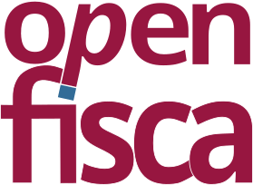

layout: true

<footer style="position: absolute; bottom: 0em; left: 0em; right: 0em;">
  
  
</footer>

---

class: center, middle

# Écrire la loi en Python

PyCon France 2016 à Rennes

[Christophe Benz](mailto:christophe.benz@data.gouv.fr)

# openfisca.fr

???

Je m'appelle ... je travaille à Etalab, service du premier ministre.

Je vais vous parler de :

- comment on écrit la loi en Python depuis quelques années
- quels sont les enjeux démocratiques
- ce qui se passe lorsque l'état libère son logiciel de calcul de l'impôt
- en quoi la situation s'est améliorée depuis 2011

Je suis développeur, au départ je n'y connaissais rien en fiscalité mais ce n'est pas un problème pour participer au projet !

---

# Quelles lois ?

- les impôts
- les aides
- l'entreprise
- autres

???

Quelles lois sont écrites en Python ? Tout ce qui se calcule en euros. On parle de lois fiscales pour les impôts et sociales pour les aides.

---

# Les affirmations bidon

Exemple : [le RSA rapporterait plus que le SMIC](http://rue89.nouvelobs.com/rue89-eco/2013/03/12/la-fable-bidon-de-la-famille-rsa-qui-gagne-plus-que-la-famille-salariee-240493)


???

- politiques et journalises affirment des choses, créant des polémiques
- Pourquoi écrire la loi en Python ?
  - pour effectuer des calculs fiables
  - fonder la décision sur des résultats reproductibles.

---

count: false

# Les affirmations bidon

Exemple : [le RSA rapporterait plus que le SMIC](http://rue89.nouvelobs.com/rue89-eco/2013/03/12/la-fable-bidon-de-la-famille-rsa-qui-gagne-plus-que-la-famille-salariee-240493)


---

# Les calculateurs


- une situation en entrée
- évaluation de formules de calcul
- un résultat en sortie
- simulateur – calculateur

???

Pour cela il nous faut un calculateur et des formules de calcul :

- on entre une situation : des individus, familles, salaires, loyer, etc.
- on calcule par exemple l'impôt sur le revenu, les allocations familiales, etc.
- le terme calculateur est employé lorsque le résultat est officiel, sinon on dit un simulateur

---

# Situation en 2011

- les calculateurs sont éparpillés
- accessibles ou pas – mais propriétaires
- les démarches sont morcelées
- les économistes sont coincés

???

- la situation n'est pas idéale
- les domaines de la loi sont inter-dépendants

---

# Une solution


- modèle unifié
- logiciel libre
- performance
- pédagogie

???

Pour y remédier on peut soit se battre pour l'ouverture, soit créer une alternative en dehors de l'état.

---

# Un pari ambitieux

<div style="float: left; margin-right: 1em;">
  .center[]
</div>

Qui maîtrise le sujet ?

<br><br>Traduction en code source !

???
On part des textes de loi, complexes vous en conviendrez.
Économistes et développeurs font bon ménage, les geeks veulent écrire la loi en Python.
C'est un pari ambitieux mais on finit par y arriver !

---

<h1 style="margin: 0">Visualisation des formules</h1>


???
On peut dessiner un graphe de dépendances des formules.

---

class: center, middle

# La réalité est complexe
# La loi est complexe
# Pas de simplification hâtive

???
La philosophie du projet OpenFisca est que si on simplifie trop tôt on risque de léser des tas de gens.
Il vaut mieux d'abord appréhender cette complexité avec les bons outils.

---

class: center, middle


Démonstrateur – https://ui.openfisca.fr/

???
- on a ici réunis au même endroit un ensemble d'indicateurs qui auparavant étaient éparpillés dans de nombreux calculateurs.
- outil pour connaisseurs

---

# Intermède

```python
def impot(salaire):
    return salaire * 0.3
```

???
Prenons un peu de recul pour mieux comprendre : codons l'impôt sur le revenu.

---

count: false

# Intermède

```python
def impot(salaire):
    return salaire * 0.3

def allocations(salaire):
  return 1000 if salaire < 10000 else 0
```

---

count: false

# Intermède

```python
def impot(salaire):
    return salaire * 0.3

def allocations(salaire):
  return 1000 if salaire < 10000 else 0

def revenu_disponible(salaire):
    return salaire - impot(salaire) + allocations(salaire)
```

## Et voilà ! Mais est-ce exact ?

???
Ces formules sont-elles exactes, càd reflètent bien la loi ?

---

# Fiabilisation par les tests

- tests écrits en même temps que les formules
- tests consolidés suite à la détection d'erreurs
- [outil web](https://mes-aides.gouv.fr/tests/) de création de tests

???
- Comme pour les logiciels avec les tests unitaires.
- Les tests sont écrits en même temps que les formules.
- Lorsqu'on s'aperçoit qu'il existe une erreur de calcul, on crée un test et on le fait passer.
- Il existe un outil web pour déclarer des tests

---

# Composants logiciels

- moteur de calcul : [OpenFisca-Core](https://github.com/openfisca/openfisca-core)
- législation Franç<a href=""></a>ise : [OpenFisca-France](https://github.com/openfisca/openfisca-france)
- API Web HTTP+JSON
- api.openfisca.fr ou auto-hébergement

???
- le moteur est détaché du pays

---

# Calculer des cas individuels

- utile pour les particuliers
- https://mes-aides.gouv.fr/
- https://embauche.beta.gouv.fr/
- utilisent l'API Web

???
Ces produits appellent en bout de chaîne l'API web d'OpenFisca.

---

<h1 style="margin: 0">mes-aides.gouv.fr</h1>

.center[]

---

<h1 style="margin: 0">embauche.beta.gouv.fr</h1>

.center[]

---

# Études d'impact

- utile pour les économistes
- données secrètes / données générées
- réformes : qui gagne, qui perd ?
- calcul vectoriel avec NumPy

???

- Plus intéressant : on peut calculer sur une population
- 10 secondes pour 120 000 individus
- exemple de réforme : suppression de la tranche d'impôts

---

<h1 style="margin: 0">Jupyter notebook</h1>

.center[]

---

<h1 style="margin: 0">Comprendre la loi</h1>

.center[]

???
Une carte de chaleur qui a été faite en Python mais en dehors d'OpenFisca.

---

# Nouveaux défis

- fiablité
- confiance (non-officiel)
- contributions
- maintenance par domaine

???

Une fois qu'on a ces outils libres de nouveaux défis apparaissent.

---

# La « Calculette Impôts »

- administration fiscale
- libérée en avril 2016
- OpenFisca plus fiable

???
- c'est une première
- Elle couvre les impôts sur les revenus, OpenFisca couvre en plus le social, l'entreprise...

---

# Compilation en Python

- langage M, remonte à 1989
- livré sans le compilateur
- écriture d'un compilateur en Python

???
Langage M adapté aux non-informaticiens

parser à grammaire « PEG » avec [Arpeggio](http://igordejanovic.net/Arpeggio/getting_started/)

Le parser génère un arbre syntaxique qui permet de générer du Python.

---

# Calcul en ligne de commande

Un célibataire :

```
$ calculette-impots calculate V_ANREV=2014 TSHALLOV=30000 IRN
{ "IRN": 2461 }
```

Un couple marié :

```
$ calculette-impots calculate V_ANREV=2014 \
  TSHALLOV=10000 TSHALLOC=20000 V_0AM=1 V_0AX=05051980 IRN
{"IRN": 264 }
```

???
On peut désormais lancer un calcul depuis la ligne de commande.

---

<h1 style="margin: 0">Hackathon #CodeImpot</h1>

.center[]

???

Une fois le code M compilé en Python, des ateliers de travail ont pu avoir lieu
lors d'un hackathon organisé à la fondation Mozilla où était présente l'équipe qui travaille sur
la calculette.

- 3 ministres
- développeurs, agents de l'état, économistes, citoyens

- M vers JavaScript : calculateur web offline !
- code législatif vers code source
- optimisation du temps de calcul
- correspondances M / OpenFisca
- gain à la déclaration commune
- réformes : revenu de base

---

# Comparaison des résultats

- génération aléatoire de ~2000 familles
- exécution des calculs dans chaque calculateur
- référence : le simulateur en ligne des impôts
- les écarts apparaissent
- gérer des cas de plus en plus complexes

???

- Désormais OpenFisca peut être comparé à un autre calculateur, officiel.
- Une population est générée en utilisant certaines cases de la déclaration simplifiée.
- l'exécution du simulateur en ligne est automatisée
- si on ajoute des cases d'autres erreurs vont apparaître dans OpenFisca
- Comparaison [graphique](https://github.com/openfisca/combine-calculators/blob/master/scripts/visual_comparisons.ipynb) des résultats

---

# Comment aider ?

- logiciel libre géré par la communauté
- utiliser OpenFisca pour un article, une étude
- implémenter des formules
- créer un outil
- améliorer l'existant

???

- le gros de notre travail consiste à simplifier l'écriture des formules

---

class: center, middle

## L'État tend à plus d'ouverture.<br>La société civile en bénéficie.

.center[[](http://www.renaissancenumerique.org/publications/rn/792-2016-04-18-08-25-24)]

<h1 style="margin: 0">Un outil neutre pour un débat informé</h1>

???

- la situation est bien meilleure qu'en 2011, le cadre est posé
- d'autres pays sont intéressés (début Novembre hackathon à Dakar (Sénégal))
- ouverture du [calculateur INES](https://git.framasoft.org/openfisca/ines-libre) par l'INSEE
- questions

---

count: false
class: center, middle

# Source des slides

Sur [GitHub](https://github.com/openfisca/communication/tree/master/docs/PyConFR-2016)
